# E-Commerce-Website 
- E-commerce Website built with django
- Use Django, Bootstrap, PostgreSQL, Celery, Redis
- Deploy on Heroku with AWS S3 storage
- Live Deployment: https://dlin99-django-ecommerce.herokuapp.com/

# Tech & Tools:
1. Backend: Django 3.1.3
2. Frontend: Bootstrap 4.3.1 
3. Database: Postgresql
4. Storage: AWS S3
5. Asynchronous Tasks: Celery + Redis
6. Payment: Paypal API (Sandbox)

# Functions:
- Shopping:
  - Purchase products as a logged in or a guest user.
  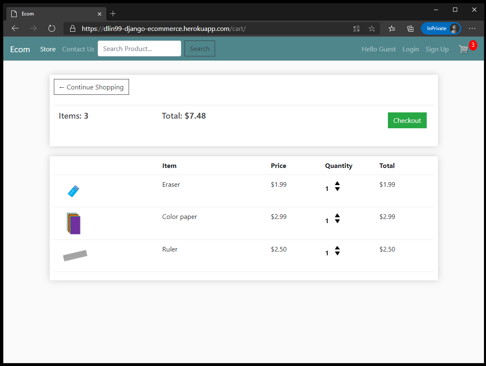
- Logged In User:
  - Login and Signup Pages
  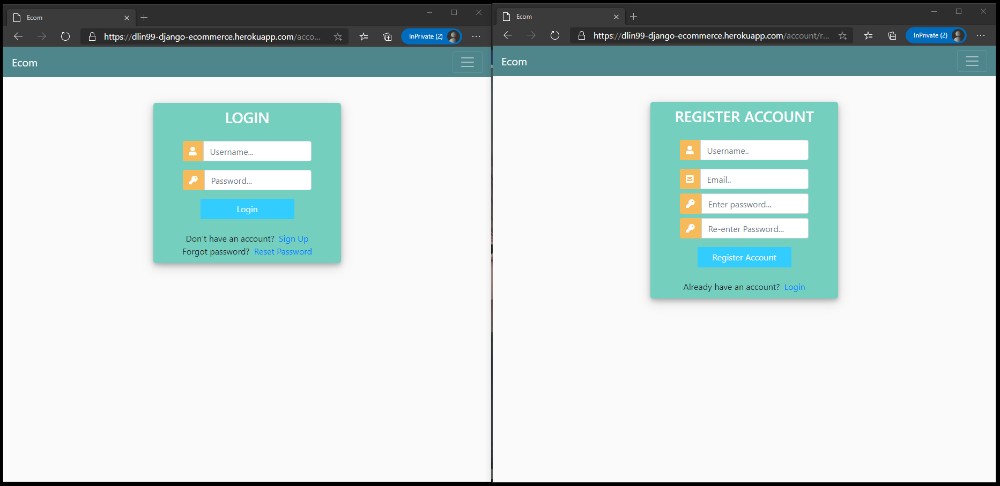
  - Forget Password, Reset via Email
  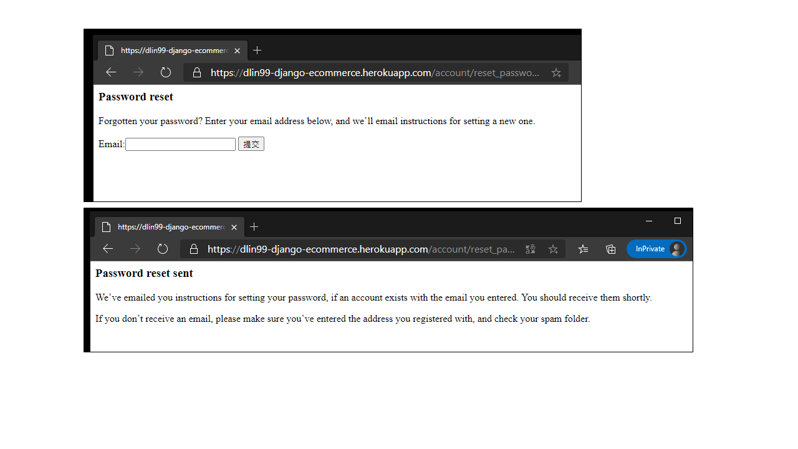
  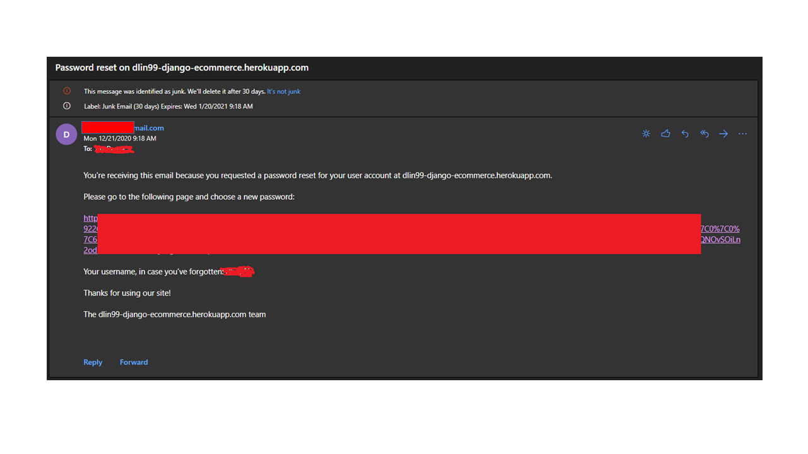
  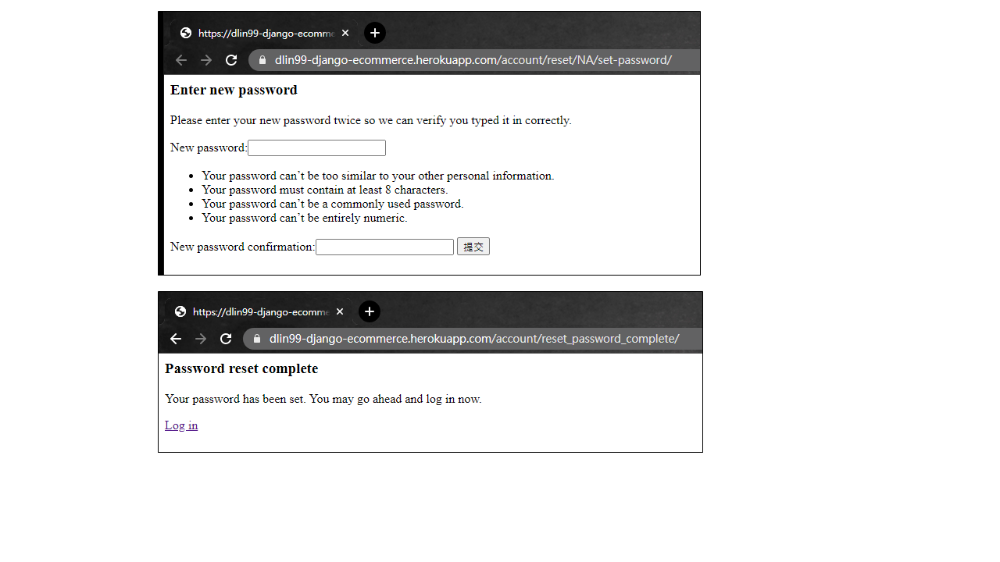
  - Change Password
  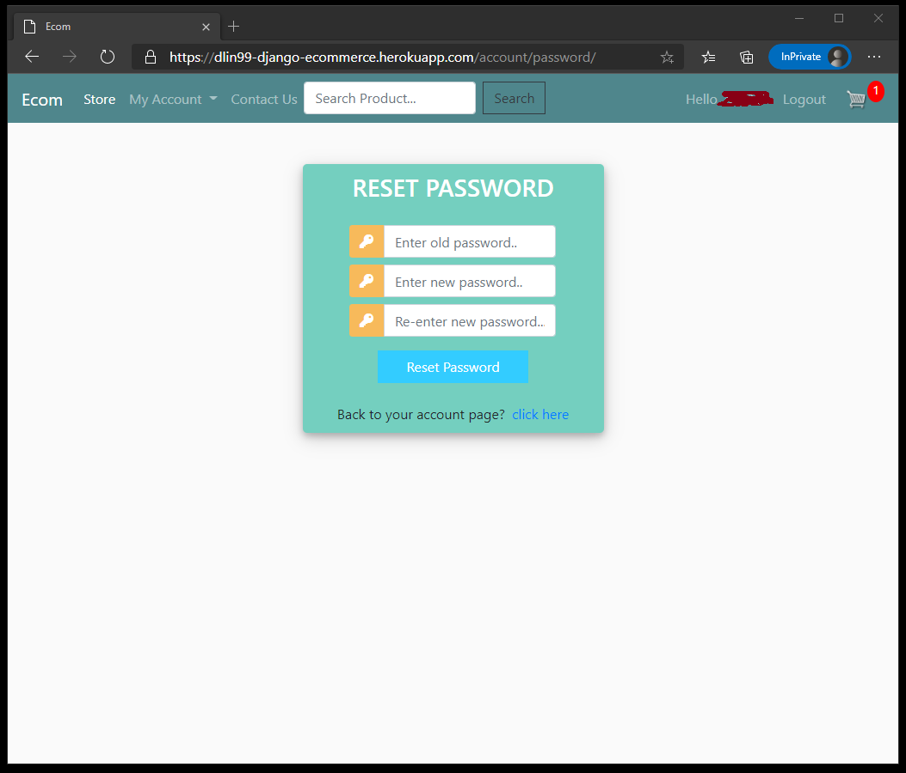
  - Profile/Change Profile Pages
  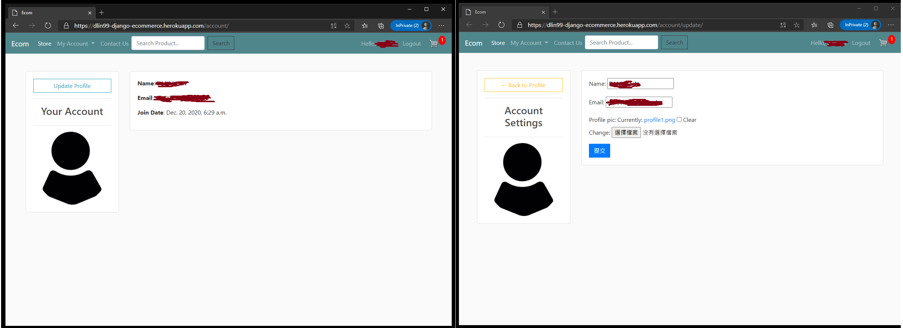
  - My Orders Page/Order Details
  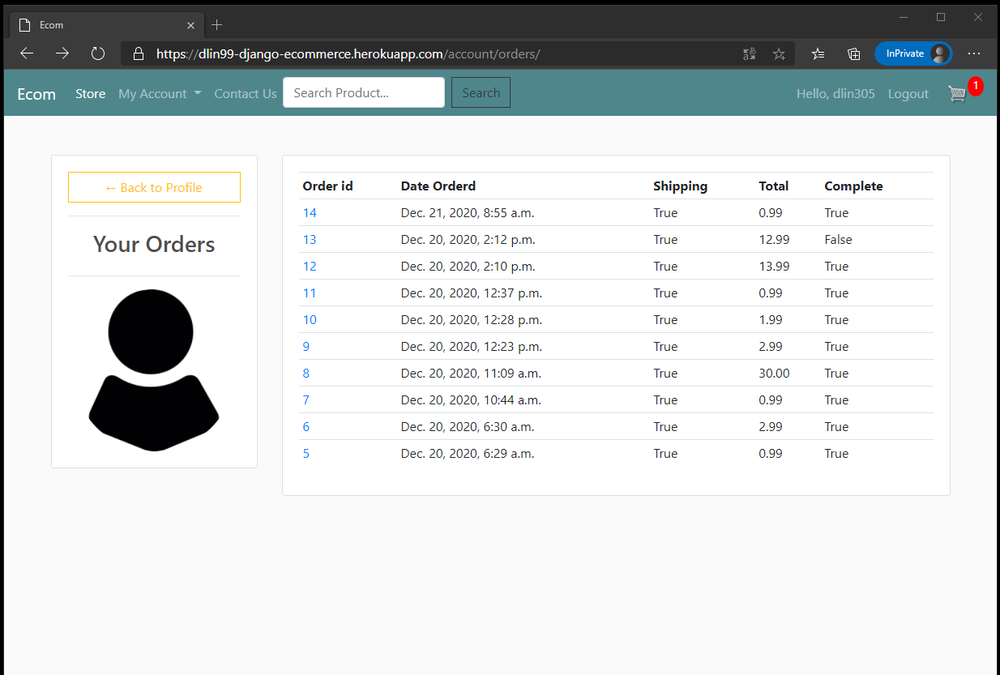
  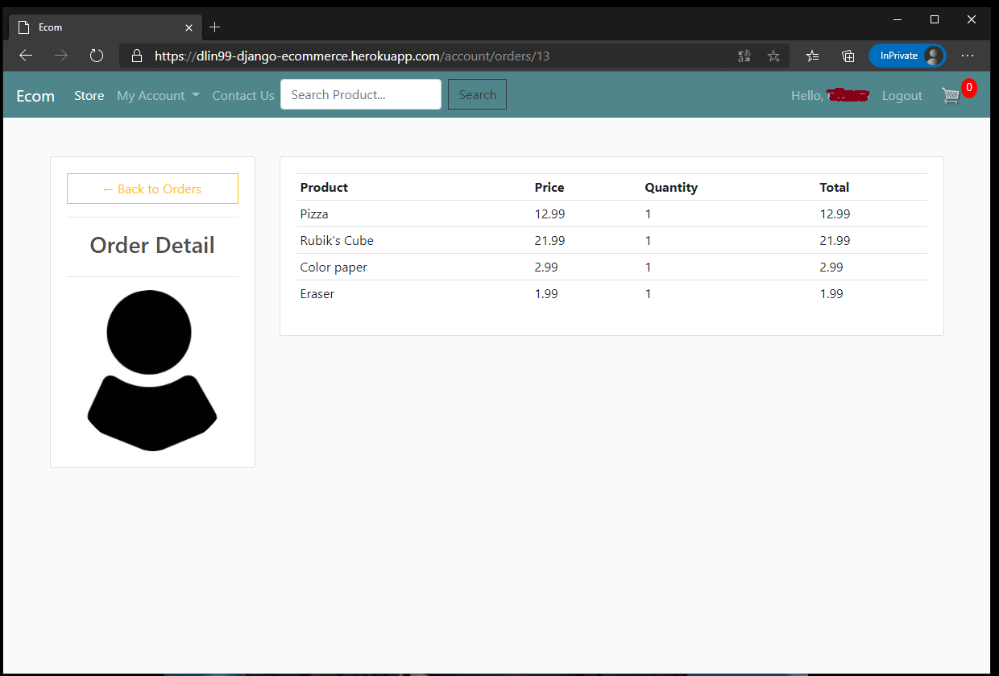 
- Homepage:
  - Show all the products with pagination (6 items per page)
  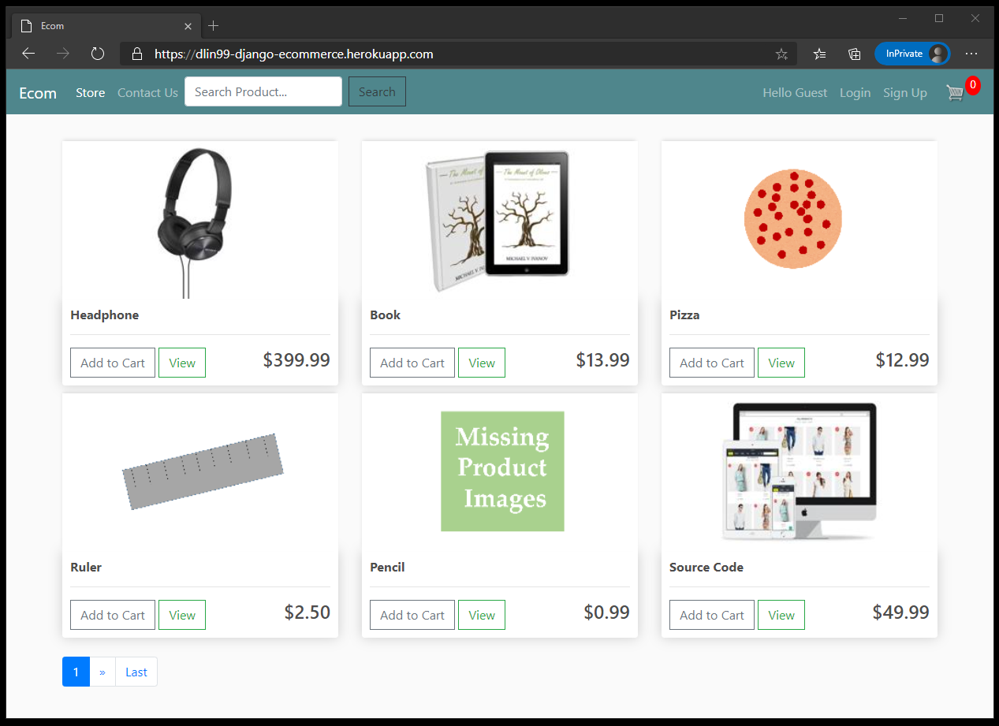
- Product Page:
  - Show the details of individual product
  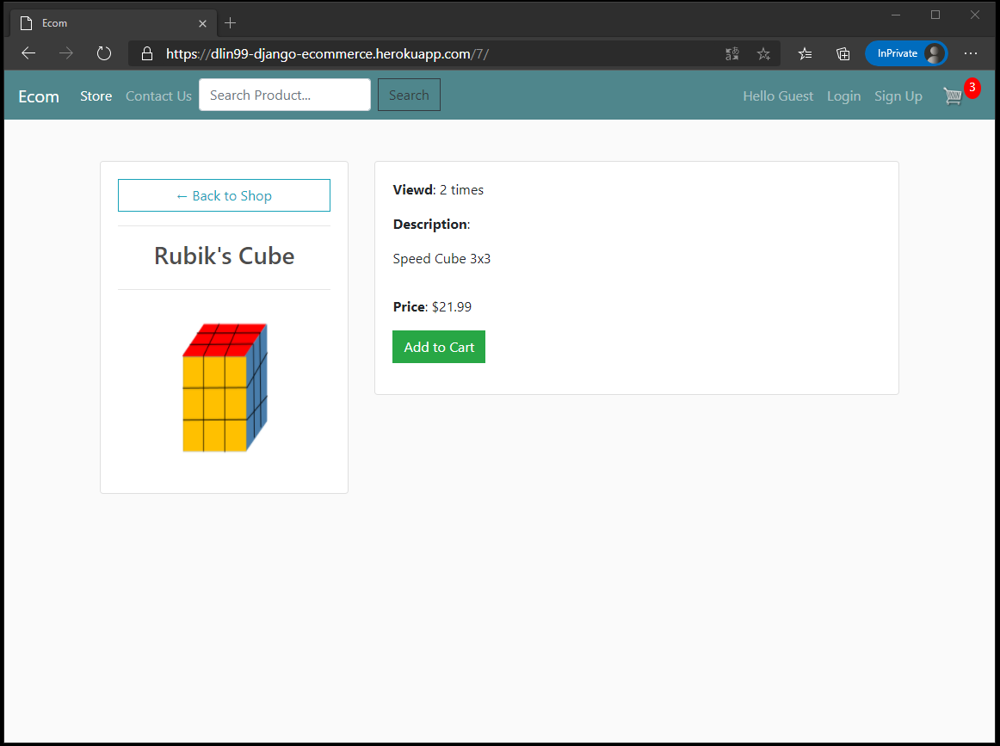
- Cart Page:
  - Show all the items in your shopping cart
  
- Checkout:
  - Use Paypal API to handle the payment
  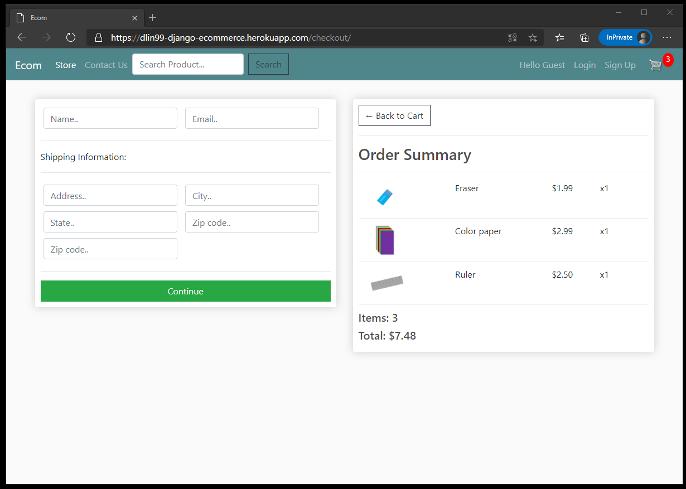
  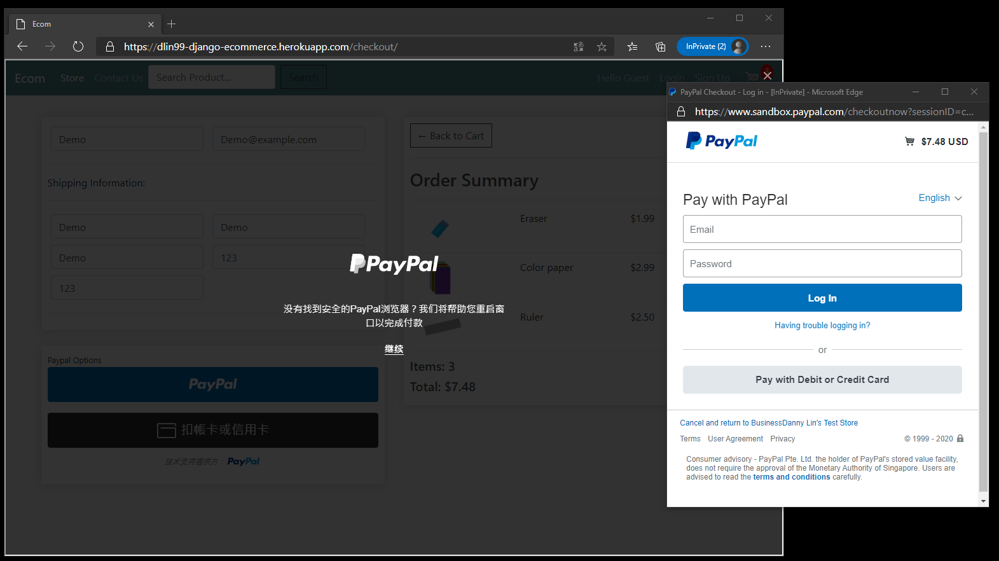
  - Confirmation Email will be sent after payment
  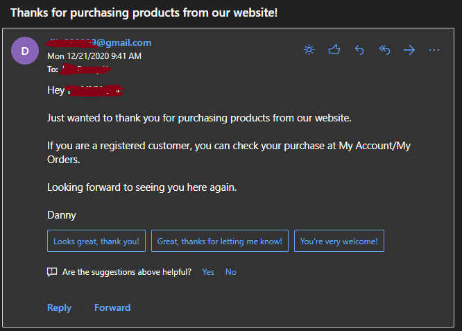
  - Use Celery + Redis to handle the process of sending confirmation emails
- Contact Us:
  - Send email to us
  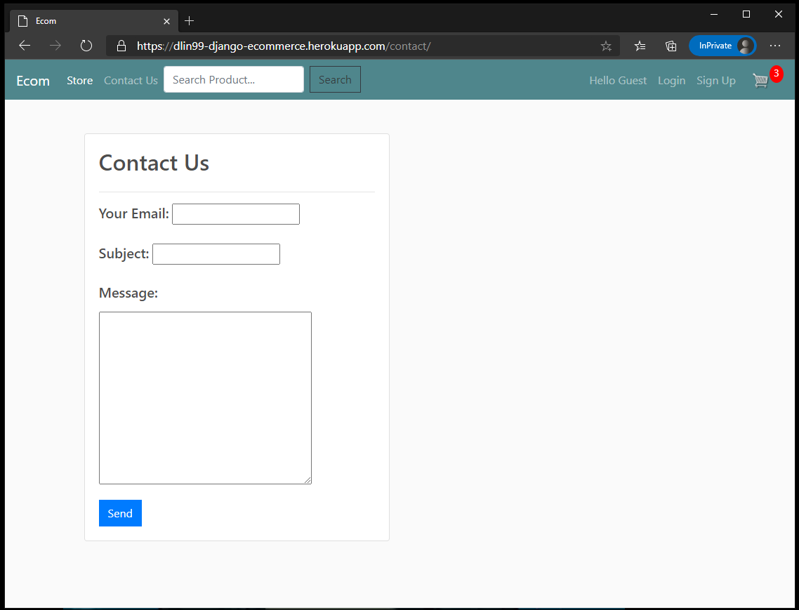  
- NavBar:
  - Search bar for finding certain products
  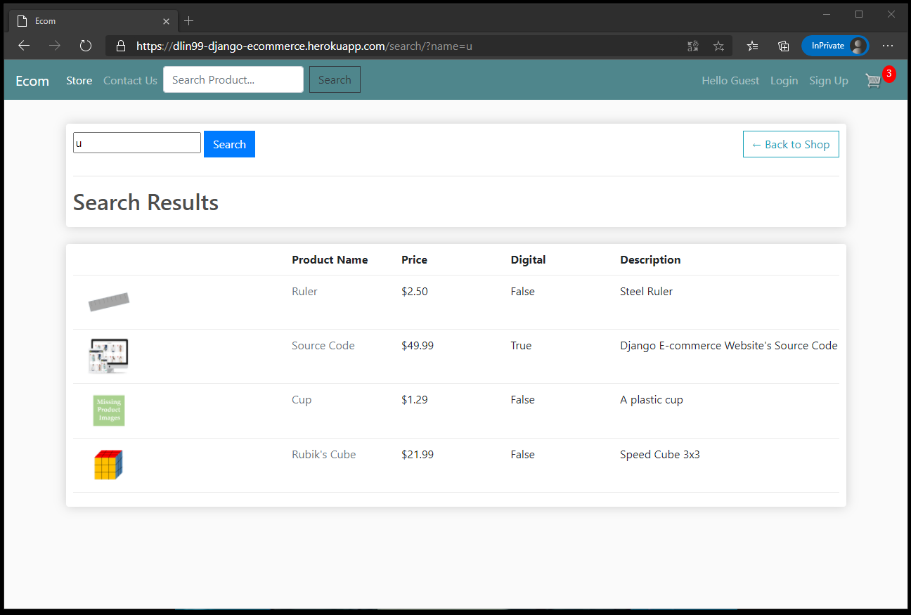

# To use:
1. git clone this repository to your computer
2. `python3 -m venv venv`
3. `. venv/bin/activate`
4. `pip install -r requirements.txt`
5. `python manage.py migrate`
6. `python manage.py createsuperuser`
7. run http://localhost:8000/

# Reference:
1. Project for the Course taught by Dennis Ivy. (https://www.youtube.com/playlist?list=PL-51WBLyFTg0omnamUjL1TCVov7yDTRng)